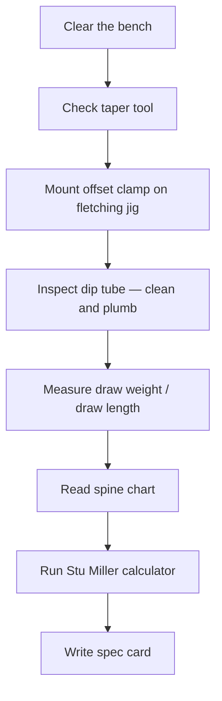

You own all the tools. You have a bow. Now you need 24 arrows — but cutting wood you have bought is permanent, and the wrong spine means 24 arrows that will never fly cleanly. How do you know which shaft to order before you spend money, before you cut a single inch?

## The mechanism

Before touching a shaft, two things must be true: your workspace is set up so you can work cleanly and safely, and your spine specification is calculated so you know exactly what to order. These look like separate problems. They are not. Setting up the workspace is itself the first act of the build, and walking through it before the math keeps you from ordering shafts and then discovering your  is cracked or your jig clamp is missing the offset plate.

### Workspace setup: bench, jig, dip tube

Clear the bench down to bare wood. Arrow building requires a flat, stable surface — adhesives, lacquer, and small parts are unforgiving of clutter. Place a sheet of craft paper or newspaper as a drop cloth before any finishing work begins.

**Taper tool check.** The  cuts two tapers: a 5-degree point taper on the front end of the shaft, and an 11-degree  on the back end.[^tapers] Before the first shaft touches it, rotate the blade by hand. It should spin smoothly with no wobble. Confirm the blade depth stop is set so the taper length is approximately 3/4 inch at the point end — per the 3Rivers guide, you measure from the nock valley to desired length, then add 3/4 to 7/8 inch for the taper before cutting.[^tapering]

** and offset clamp.** Your jig uses an offset clamp rather than a full helical clamp. For a left-handed archer shooting left-wing feathers, the offset angle should be set with a slight left-angle offset (typically 2–3 degrees) so the feathers spin the arrow in a direction that stabilizes the left-wing vane geometry.[^wingconsistency] Mount the clamp on the jig's arm and verify the rotation positions lock firmly at the 120-degree detents. Loose detents produce a twisted three-fletch.

**Dip tube.** The  must be clean, dry, and plumb before you load any finish. Hold it vertical against a wall and check with a level. A tube stored at an angle develops residue buildup along one wall that produces an uneven coat on the first few shafts.[^diptube] Use a long bottle brush with a dry rag to confirm no dried lacquer rings inside. If there are rings, soak with denatured alcohol and brush again before adding fresh finish.

With workspace ready, turn to the math.

###  and the 

 is a laboratory measurement, not a shooting measurement. The test suspends an 880-gram (1.94 lb) weight from the center of a shaft supported 28 inches apart; the deflection in inches, multiplied by 1000, gives the spine rating.[^staticspine] A shaft that deflects 0.500 inches is labeled "500 spine" in modern notation.

For wood arrows, the industry uses a slightly different protocol called the : a shaft supported at 26-inch centers with a 2-pound weight at center; spine is reported as 26 divided by deflection (e.g., 0.5 inch deflection = 52-pound spine).[^amostandard] When you see a  labeled "50/55#," that is an AMO wood-standard range designation, not a modern 1000-scale decimal rating.

The label on the shaft is only a starting point. Static spine is measured under controlled conditions; your arrow has to flex through  at the speed of a 40-pound draw, with a 100-grain field point on the front end, cut to your specific . Those conditions change the effective stiffness considerably.

### : what actually happens on the shot

 is the effective stiffness of the arrow during the actual shot — how it bends, oscillates, and recovers as it accelerates off the string.[^dynamicspine] Five variables drive it:

- **Shaft length** — every inch of additional length weakens (lowers) dynamic spine by approximately 5 lb
- **Point weight** — heavier points load the front of the shaft and weaken dynamic spine
- **** — more stored energy means more bending force on release
- **Bow design** — a recurve with a deep  creates less paradox offset than a longbow with no window
- **Release style** — a smooth, consistent finger release disturbs the arrow less than a jerky one

Easton's technical documentation makes the key point explicit: "Dynamic spine describes how an arrow responds to a bow's stored energy during actual shooting. Because countless variables affect this behavior, manufacturers typically don't use this measurement for commercial spine ratings."[^dynamicspineeaston] This is why a 45# spine shaft bought for your 40 lb bow may fly beautifully for one archer and fishtail for another — their dynamic spines differ even though the static labels match.

### : why spine match is critical for traditional bows

The arrow rests to the side of the riser. At the moment of release, it points *away* from the target. And yet it flies to the target. That is .



Wikipedia's description captures it precisely: "The paradox is that an arrow will fly in a straight line to a target when it starts off pointing away from the target. In order to be accurate, an arrow must have the correct stiffness, or 'dynamic spine', to flex out of the way of the bow and to return to the correct path as it leaves the bow."[^paradox]

The recovery sequence matters for spine selection:

1. At release, string energy pushes the nock forward; the shaft bends around the riser.
2. The arrow's own stiffness causes it to spring back toward straight.
3. The arrow oscillates several times before it clears the bow completely.
4. If the spine is *too stiff*, the arrow does not bend enough to clear the riser cleanly — for a left-handed archer, a stiff arrow kicks right (toward the bow shelf) and impacts left of the aiming point.
5. If the spine is *too weak*, the arrow over-bends, recovers past straight, and again misses line — for a left-handed archer, a weak arrow kicks left and impacts right.

This is why Wikipedia draws the explicit contrast with modern target bows: "Modern target bows often have risers with an eccentrically cutout arrow window; being centre shot, these bows do not exhibit any paradoxical behaviour as the arrow is always pointing visually along its line of flight."[^modernbows] Your traditional bow is *not* center shot. Spine match is not optional.

### Draw weight and draw length: the two inputs the chart needs

 is the peak force in pounds to draw the bow to the rated draw length — 40 lb for this build.[^drawweight]  is the distance from the  on the string to the back of the bow at full draw.[^drawlength]

The spine charts assume 28-inch AMO draw length as the baseline. For this build, 28 inches is the working default because the learner's actual draw length is not yet measured. Before you order shafts, you should measure your actual draw length — or use the formula below to express the spine selection as a function of what you measure.

### Spine calculation: Rose City chart vs Stu Miller calculator

Two tools give you a spine recommendation for your setup. Here is the worked example for this build's exact parameters: **40 lb draw weight, 28-inch AMO draw length, 100-grain , 11/32-inch Port Orford cedar.**

**Tool 1 — Rose City Archery spine chart**

The Rose City chart is the most widely cited manufacturer reference for Port Orford cedar shaft selection. For a 40 lb recurve or longbow at 28 inches with 100-grain points, the chart recommends approximately **50–55# spine** for a wood arrow shaft.[^rosecity]

An important note on cedar: Rose City makes the point that "The  of Port Orford Cedar Arrows is virtually natural and cannot be 'manufactured'. The spine weight is solely determined by the diameter of the shaft and the density of the Port Orford Cedar wood."[^pocdensity] This means you do not select a specific spine — you select a diameter and density grade, and the spine follows from the wood.

**Tool 2 — Stu Miller's Dynamic Spine Calculator**

The calculator at [heilakka.com/stumiller](https://heilakka.com/stumiller/) takes draw weight, draw length, point weight, shaft length, and bow type as inputs and returns a recommended spine. For 40 lb / 28 inch / 100 gr, the calculator typically returns a result in the **50–55# range as well**, confirming the chart.[^stumiller]

Where they can diverge: if you adjust point weight to 125 gr (a heavier field point), the calculator may shift the recommendation toward 45–50# (weaker/lighter) because the added front weight increases dynamic spine load. The chart, being a simpler two-variable lookup, may not capture that nuance. When the two tools agree, use that range as your purchase spec. When they diverge, trust the calculator for your specific parameters — it accounts for more variables.[^calculatormethodology]

**The per-inch adjustment rule**

Draw length is the most personal variable in the system. Rose City states the rule explicitly: "For cutting to your personal draw length you will need to deduct 5 lbs (1 spine weight increment lower) for every inch cut off below 28 inches. For every inch above 28 you will need to add 5 lbs or 1 spine weight increment per inch."[^perinch]

Expressed as a function for this build:

| If your draw length is… | Adjust the 50–55# starting spine by… | Purchase spine target |
|---|---|---|
| 26 inches | −10 lb (2 increments stiffer — shorter = less bend force) | 40–45# |
| 27 inches | −5 lb (1 increment stiffer) | 45–50# |
| **28 inches (default)** | **no adjustment** | **50–55#** |
| 29 inches | +5 lb (1 increment weaker) | 55–60# |
| 30 inches | +10 lb (2 increments weaker) | 60–65# |

*Wait — should "stiffer" mean higher or lower number?* In the AMO wood standard, a higher spine number (55#) means a stiffer shaft than a lower number (45#). This is the reverse of the modern 1000-scale decimal notation used for carbon and aluminum, where a higher number (e.g., 600) means a weaker, more flexible shaft. With wood arrows, always ask: "higher number = stiffer."[^amostandard]

When you measure your actual draw length, locate it in the table and that becomes your purchase specification.

## Wood vs carbon: when the alternative wins

| Criterion | Port Orford cedar | Carbon / aluminum |
|---|---|---|
| Consistent spine shaft-to-shaft | Variable — natural wood density varies | Excellent — manufactured to tolerance |
| Moisture and warp resistance | Requires sealing; cedar warps without it | Carbon: no moisture issue; aluminum: minor |
| Repairability | High — points, nocks, feathers replaceable at home | Carbon: replace the shaft; aluminum: bendable |
| Tactile and aesthetic experience | The whole point for traditional archery | Functional but impersonal |
| **High-volume competitive 3D durability** | **Carbon wins here — do not choose cedar for this** | **Carbon arrows do not warp, absorb no moisture, hold spine indefinitely** |

For this build — 24 target arrows for a traditional left-handed bow, building for craft and competence — cedar is correct. If the goal were a competitive 3D season shooting 100+ arrows a day in wet conditions, carbon would be the right call.

## What this means for the matched set

For the matched set of 24 Port Orford cedar arrows, 11/32-inch diameter, 100-grain glue-on field points, 40 lb bow:

- **Purchase spec at 28 inches AMO:** 50–55# cedar shaft in 11/32-inch diameter.
- **Measure your draw length before ordering.** Use the table above to adjust the spine target. If your draw length is 29 inches, order 55–60# shafts.
- The 11/32-inch diameter is correct for a 40 lb bow shooting off the shelf. It provides enough mass for stable flight without overloading the bow.
- Order 26–28 shafts for a 24-arrow batch — expect 2–4 culls when you straighten and sort the batch in module 2.

The workspace setup and spine spec card you produce in the exercises for this module are the prerequisites for everything that follows. Do not skip the spec card — it is your purchase reference.

## Reading

- **Primary:** [Easton Archery — Making Sense of Arrow Spine](https://eastonarchery.com/2014/07/making-sense-of-arrow-spine/) — Static spine and dynamic spine sections. Read both to understand why the label on the shaft is only a starting point, not the final answer.
- **Secondary:** [Stu Miller's Dynamic Spine Calculator](https://heilakka.com/stumiller/) — Overview and How to Use. Run the calculator with the 40 lb / 28" / 100 gr worked example before moving to the shaft-prep module.

## Coming next

Module 2 assumes you have a written spec card in hand — shaft diameter (11/32"), target static spine (50–55# at 28", adjusted for your actual draw length), shaft material (Port Orford cedar), point weight (100 gr), draw weight (40 lb) — and are ready to evaluate a batch of raw shafts for straightness, spine consistency, and grain quality before any cutting begins.

---

[^tapers]: The two taper angles — 5-degree  and 11-degree  — are the industry standard for wood arrow shafts. See: Stickbow.com, [Point and Nock Tapers](http://www.stickbow.com/stickbow/arrowbuilding/tapertools.html).

[^tapering]: As the 3Rivers Building Wood Arrows guide states: "Measure from the nock valley to desired length, then add 3/4" to 7/8" for the taper before cutting." — [3Rivers Archery — Building Wood Arrows](https://www.3riversarchery.com/blog/building-wood-arrows/)

[^wingconsistency]: As Wikipedia's Fletching article notes: "A right handed archer should shoot a right winged feather and right handed helical, and a left handed archer should use the opposite. Modern slow-motion analysis reveals that the arrow does not begin to spin until it is well past the riser, making consistency in fletching more critical than theoretical preferences." — [Wikipedia — Fletching](https://en.wikipedia.org/wiki/Fletching)

[^diptube]: ArcheryTalk community consensus on dip tube maintenance: a tube that has been stored at an angle or left with dried lacquer inside will produce an uneven first coat. See: [ArcheryTalk — Which Wooden Arrow  and Why](https://www.archerytalk.com/threads/which-wooden-arrow-sealer-why.2241698/)

[^staticspine]: As Easton Archery's spine documentation explains: "An 880-gram (1.94 lbs.) weight is suspended from the center of the arrow supported 28 inches apart. The resulting deflection in inches, multiplied by 1000, determines the spine rating." — [Easton Archery — Making Sense of Arrow Spine](https://eastonarchery.com/2014/07/making-sense-of-arrow-spine/#static-spine)

[^amostandard]: The AMO wood arrow spine protocol uses 26-inch support centers and a 2-pound weight; spine is reported as 26 divided by deflection. See: [ShootingTime — Arrow Spine: Static, Dynamic, and How to Adjust](https://shootingtime.com/archery/arrow-spine/)

[^dynamicspine]: Dynamic spine is defined as the effective stiffness during the shot, driven by shaft length, point weight, draw weight, bow design, and release style. See: [Easton Archery — Making Sense of Arrow Spine](https://eastonarchery.com/2014/07/making-sense-of-arrow-spine/#dynamic-spine) and [Stu Miller's Dynamic Spine Calculator](https://heilakka.com/stumiller/)

[^dynamicspineeaston]: "Dynamic spine describes how an arrow responds to a bow's stored energy during actual shooting. Because countless variables affect this behavior, manufacturers typically don't use this measurement for commercial spine ratings. Shooters can adjust dynamic spine by modifying draw weight, point weight, string material, vane weight, or arrow length." — Easton Archery, [Making Sense of Arrow Spine](https://eastonarchery.com/2014/07/making-sense-of-arrow-spine/#dynamic-spine)

[^paradox]: "The paradox is that an arrow will fly in a straight line to a target when it starts off pointing away from the target. In order to be accurate, an arrow must have the correct stiffness, or 'dynamic spine', to flex out of the way of the bow and to return to the correct path as it leaves the bow." — Wikipedia, [Archer's paradox](https://en.wikipedia.org/wiki/Archer%27s_paradox#description)

[^modernbows]: "Modern target bows often have risers with an eccentrically cutout arrow window; being centre shot, these bows do not exhibit any paradoxical behaviour as the arrow is always pointing visually along its line of flight." — Wikipedia, [Archer's paradox](https://en.wikipedia.org/wiki/Archer%27s_paradox#traditional-vs-modern)

[^drawweight]: Draw weight is the peak force in pounds to draw the bow to the rated draw length. It is the primary input for spine selection. See: [3Rivers Archery — Basic Longbow and Recurve Set-Up](https://www.3riversarchery.com/blog/longbow-and-recurve-set-up/) and [Rose City Archery — Spine Weight Chart](https://www.rosecityarchery.com/pages/spine-weight-recurve-longbow-compound-bow-chart)

[^drawlength]: Draw length directly affects arrow length, which in turn affects dynamic spine: one inch longer weakens dynamic spine by approximately 5 pounds. See: [Rose City Archery — Spine Weight Chart](https://www.rosecityarchery.com/pages/spine-weight-recurve-longbow-compound-bow-chart) and [ShootingTime — Arrow Spine](https://shootingtime.com/archery/arrow-spine/)

[^rosecity]: The Rose City Archery spine chart is the most widely cited manufacturer reference for Port Orford cedar shaft selection. For 40 lb / 28 in. / 100 gr, the chart recommends approximately 50–55# spine for a wood arrow. — [Rose City Archery — Spine Weight Chart](https://www.rosecityarchery.com/pages/spine-weight-recurve-longbow-compound-bow-chart)

[^pocdensity]: "The spine weight of Port Orford Cedar Arrows is virtually natural and cannot be 'manufactured'. The spine weight is solely determined by the diameter of the shaft and the density of the Port Orford Cedar wood." — Rose City Archery, [Spine Weight Chart](https://www.rosecityarchery.com/pages/spine-weight-recurve-longbow-compound-bow-chart#port-orford-cedar)

[^stumiller]: "The calculator was developed to aid the traditional archer in defining the appropriate arrow setup to match a given bow design. The formulas are derived primarily from modern deflex/reflex longbow and recurve designs based on actual shooting experience coupled with basic engineering principles." — Stu Miller's Dynamic Spine Calculator, [heilakka.com/stumiller](https://heilakka.com/stumiller/#overview)

[^calculatormethodology]: Stu Miller's calculator methodology note: "The absolute best way to start with Stu's is to input known bow/arrow specs that are already tuned and fly well for you, then alter the Personal Form Factor until the numbers are within 2 pounds, and keep the PFF constant throughout your inputs of other arrows and bows." — [heilakka.com/stumiller](https://heilakka.com/stumiller/#how-to-use)

[^perinch]: "For cutting to your personal draw length you will need to deduct 5 lbs (1 spine weight increment lower) for every inch cut off below 28 inches. For every inch above 28 you will need to add 5 lbs or 1 spine weight increment per inch." — Rose City Archery, [Spine Weight Chart](https://www.rosecityarchery.com/pages/spine-weight-recurve-longbow-compound-bow-chart#adjustment)
