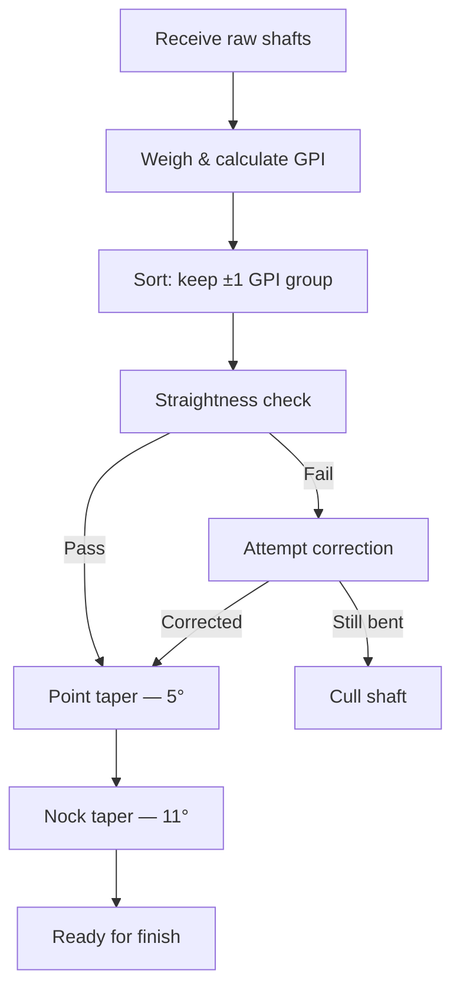
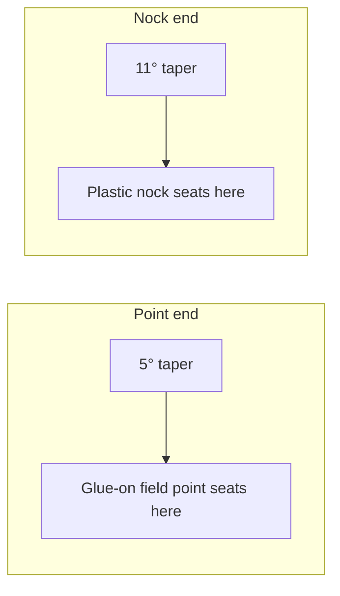

You ordered a bundle of 28 raw 11/32-inch  shafts. They arrive as a cylindrical stack smelling faintly of wood and resin. Some will be perfect. A few will be slightly bowed. One or two may turn out to weigh enough more than their neighbors that they'll never belong in a matched target set. Your job in this module is to work through the full batch-prep sequence: weigh every shaft, calculate , sort out the outliers, straighten every keeper, and cut the tapers at both ends. When you set the last shaft down, you should have 24 (or very close to 24) shafts that are straight, weight-matched, and ready for the .

## The mechanism

The four operations below happen in order. Skipping ahead — tapering a shaft before checking its straightness, for instance — wastes taper cuts on shafts you'll cull later.

### Wood species: why  for this build

 (*Chamaecyparis lawsoniana*) is the canonical shaft material for traditional target arrows in North America, and for clear mechanical reasons. The wood has an exceptionally high  relative to its density — it is stiff per unit of weight, which means it recovers from the flex of  quickly and returns to a straight flight path faster than heavier alternatives.[^poc-spine]

For a 40-pound left-handed bow at a 28-inch draw, 11/32-inch Port Orford cedar is the standard diameter. This diameter typically runs 10–13  in finished shafts, putting a fully built arrow at roughly 450–520 grains total — solidly within the 6.5–8  target window for a traditional setup.[^gpp-range]

 is stiffer and lighter than cedar, which makes it historically interesting (it was favored for flight arrows), but it is more difficult to source today and its greater stiffness at 11/32-inch can push it out of the useful spine window for a 40-pound bow. It is not part of this build.



### GPI: weighing and sorting the batch

 is the number that lets you compare shaft weights regardless of slight length differences across a bundle. The formula is simple:

> **GPI = shaft weight in grains ÷ shaft length in inches**

To calculate it, you need a  (a reloading scale works perfectly — resolution of 0.1 grain is sufficient) and a ruler or tape measure. Weigh each shaft in grains, measure its length in inches from end to end, and divide.[^gpi-calc]

**Example:** A shaft weighing 274.5 grains at 30.5 inches raw length has a GPI of 274.5 ÷ 30.5 = **9.0 GPI**.

For a matched target set, sort the batch and keep only shafts within **±1 GPI** of your chosen center value. A tighter tolerance (±0.5 GPI) is possible if your scale resolution allows it and you ordered enough extras; a looser tolerance (±2 GPI) leaves weight variation that will show up as vertical group spread at longer distances.[^gpi-tolerance]

Expect 5–15% of any raw bundle to fall outside your tolerance window. Order at least 28 shafts to build 24. Some batches from the same supplier lot will be tighter; a bundle spanning a wide diameter range within "11/32-inch" can be wider. The batch-tracking table in the exercises section gives you the right structure to record every measurement before making cut decisions.

### Shaft straightening: the heel-of-hand method

Before you make a single taper cut, every shaft in your keeper pile must be straight. Tapering a bent shaft wastes the cut and ruins the taper geometry.

The technique used by traditional arrow makers is the heel-of-hand method. As 3Rivers Archery describes it: "Port Orford Cedar is one of the most willing to stay straight. The heel of the hand method involves locating bends, placing them against your palm, and stretching fibers while applying controlled force."[^3rivers-straightening]

In practice:

1. Hold the shaft at both ends and sight down it like a pool cue. Rotate it slowly. Any bow will catch your eye as a curve in the wood's silhouette.
2. Locate the apex of the bend — the point where curvature is greatest.
3. Place that apex against the heel of your palm (the thick pad below the thumb), with the convex side of the bend facing into your hand.
4. Apply firm, controlled downward pressure with both hands simultaneously, slightly overcorrecting — you are stretching the wood fibers on the inside of the curve.
5. Re-sight. Repeat if needed.

A shaft that springs back to a bow after three correction attempts is telling you something. Either the bend is moisture-related (see the Validation scenario for this module) or the grain is genuinely off-axis and the shaft will never hold straight under shooting stress. Set it aside — do not invest taper cuts in it.



*Wood Arrow Making 101 EP2 — Hand Straightening. Watch the motion: sighting down the shaft, locating the apex of the bend, and applying controlled pressure with the heel of the palm.*

### Point taper and nock taper

Every wood shaft needs two taper cuts: a  at the point end to accept a , and an  at the nock end to accept a . Both cuts use the same taper tool (the one already in your kit), with different bushings or settings for each angle.

**Measurement sequence for the point end:** Measure from the nock valley (where the string seats) to your desired finished arrow length. Add 3/4 to 7/8 inch for the taper before you cut — this extra length becomes the tapered cone that fits inside the field point socket.[^3rivers-tapering] For our 28-inch working , a 28.5-inch finished arrow is a reasonable starting point; add 7/8 inch and mark the cut at 29.375 inches from the nock valley.

**The ** is the shallower of the two cuts. The taper creates a conical seat that matches the bore of a standard . The angle is standardized across manufacturers — a taper cut by any properly adjusted taper tool will accept points from 3Rivers, Stickbow, or any other standard supplier.[^stickbow-tapers]

**The ** is steeper. It matches the bore of standard friction-fit glue-on plastic nocks. The nock seats on the taper's shoulder, not at its tip, so the depth of cut matters — cut too deep and the nock sits loose; cut too shallow and the nock bottoms out before reaching the shoulder.

**Order of operations:** Cut the point taper first (since this requires knowing finished length), then cut the nock taper. Cutting nock taper first would make it harder to measure from the nock valley cleanly.



*Wood Arrow Making 101 EP3 — Tapering. Demonstrates both the 5° point taper and the 11° nock taper using a standard taper tool.*

### Footing: what it is, and why not here

 is a short splice of dense hardwood — hornbeam, osage orange, or bamboo are traditional choices — glued onto the point end of the shaft before tapering. The hardwood reinforces the area most likely to split on impact, dramatically extending shaft life when shooting at hard targets (stump butts, dirt banks, wooden faces).[^footing-def]

A  is a beautiful piece of craft. It is also the right choice for field archery and hunting where the arrow is being driven into irregular hard surfaces repeatedly.

**For the matched set of 24 target arrows in this curriculum, footing is not appropriate.** You are shooting 100-grain glue-on field points at foam and burlap targets. The point end of a cedar shaft in that use case very rarely splits — and if it does, the shaft is cheap enough to replace. Footing adds significant construction complexity (the splice must be cut, fitted, and glued before any tapering begins), adds a small amount of weight at the point end that shifts , and requires specialized woodworking skill to execute cleanly. None of those tradeoffs are worth taking on for a soft-target practice set.

Learn what footing is. Know when it is the right call. Do not foot these 24 shafts.



*DIY Hardwood Footed Arrow Shafts for Traditional Archery. Shows the splice cut, glue-up, and final shaping. Worth watching once even though you won't be footing this build — recognizing a footed arrow in the wild is a useful skill.*

## Cedar vs. : when to choose which

| Factor | Port Orford cedar | Douglas fir (Surewood) |
|---|---|---|
| Typical GPI at 11/32" | 10–13 GPI | 12–15+ GPI |
| Weight character | Lighter; faster arrow | Heavier; more downrange momentum |
| Straightening | Responds well to hand pressure | Stiffer grain; less forgiving |
| Spine consistency | Natural variation across a bundle | Highly consistent spine grouping |
| Taper tooling | Standard blade-style taper tool | Disc-sander tapering preferred |
| **When it wins** | Lighter bows, longer target distances, off-the-shelf shooting | Heavier bows, hunters wanting momentum, archers who want tight spine lots |

Douglas fir is not the wrong choice — it is the right choice for a different archer in a different context. For a 40-pound left-handed bow shooting at foam targets,  wins on every relevant dimension.[^douglas-fir]

## What this means for the matched set

When you work through this batch, you are making three sequential quality decisions: weight (GPI), geometry (straightness), and geometry again (taper precision). Each decision is a gate. A shaft that fails the GPI sort never gets straightened. A shaft that cannot be straightened never gets tapered. This is intentional — you preserve labor by culling early.

The practical outcome: from a bundle of 28 raw shafts, budget for 2–4 rejections across the weight and straightness gates. If you ordered 28 and get 24 keepers, that is a normal result. If you get 26, that is a good batch. If you get fewer than 22, either your tolerance was tighter than necessary or the lot was unusually variable — consider widening the GPI window by 0.5 or contacting the supplier about the lot.

## Reading

- **Primary:** 3Rivers Archery — [Building Wood Arrows](https://www.3riversarchery.com/blog/building-wood-arrows/) — read the Straightening and Tapering sections. The straightening technique must be done before tapering, not after.
- **Secondary:** Rose City Archery — [ Chart](https://www.rosecityarchery.com/pages/spine-weight-recurve-longbow-compound-bow-chart) — Port Orford Cedar section. Explains why cedar spine is a natural property of the wood and cannot be manufactured to spec the way aluminum or carbon can.

## Coming next

Module 3 assumes you have 24 straight, GPI-matched, double-tapered shafts ready to go into the dip tube for sealing and optional .

---

[^poc-spine]: Rose City Archery explains: "The spine weight of Port Orford Cedar Arrows is virtually natural and cannot be 'manufactured'. The spine weight is solely determined by the diameter of the shaft and the density of the Port Orford Cedar wood." — *Rose City Archery Spine Weight Chart*, [rosecityarchery.com/pages/spine-weight-recurve-longbow-compound-bow-chart](https://www.rosecityarchery.com/pages/spine-weight-recurve-longbow-compound-bow-chart#port-orford-cedar)

[^gpp-range]: Archery360 explains the GPP window: "For a midweight traditional arrow, a target of 6.5–8 GPP is standard. Too light (under 5 GPP) risks bow damage and excessive noise; too heavy reduces trajectory and speed." — *Archery360: How to Calculate Arrow Weight and Why*, [archery360.com/2018/06/14/how-to-calculate-arrow-weight-and-why/](https://archery360.com/2018/06/14/how-to-calculate-arrow-weight-and-why/)

[^gpi-calc]: GPI calculation method: " is calculated as shaft weight in grains divided by shaft length in inches. Port Orford cedar at 11/32-inch diameter typically runs 10–15 GPI." — *BobLeeBows: Arrow GPI vs GPP*, [bobleebows.com/arrows-critical-difference-gpi-gpp/](https://bobleebows.com/arrows-critical-difference-gpi-gpp/)

[^gpi-tolerance]: On weight-matching tolerance for matched sets: "GPI is used to compare shaft weights independently of length" and is the standard metric for sorting a batch into matched groups. — *Archery360: How to Calculate Arrow Weight and Why*, [archery360.com/2018/06/14/how-to-calculate-arrow-weight-and-why/](https://archery360.com/2018/06/14/how-to-calculate-arrow-weight-and-why/)

[^3rivers-straightening]: 3Rivers Archery: "Port Orford Cedar is one of the most willing to stay straight. The heel of the hand method involves locating bends, placing them against your palm, and stretching fibers while applying controlled force." — *3Rivers Archery: Building Wood Arrows*, [3riversarchery.com/blog/building-wood-arrows/](https://www.3riversarchery.com/blog/building-wood-arrows/#straightening)

[^3rivers-tapering]: 3Rivers Archery: "Measure from the nock valley to desired length, then add 3/4" to 7/8" for the taper before cutting." — *3Rivers Archery: Building Wood Arrows*, [3riversarchery.com/blog/building-wood-arrows/](https://www.3riversarchery.com/blog/building-wood-arrows/#tapering)

[^stickbow-tapers]: Stickbow.com's taper tool reference page documents the 5-degree point taper and 11-degree nock taper as the industry standard angles for wood arrow shafts. — *Stickbow.com: Point and Nock Tapers*, [stickbow.com/stickbow/arrowbuilding/tapertools.html](http://www.stickbow.com/stickbow/arrowbuilding/tapertools.html)

[^footing-def]: Legend Archery: "A footed arrow features a reinforcing piece of hardwood attached to its front end, typically made from materials like hornbeam or bamboo. By reinforcing the area most likely to break, the arrow is more likely to survive impact, while maintaining overall flexibility and lighter weight." — *Legend Archery: Footed Arrow*, [legendarchery.com/pages/footed-arrow](https://legendarchery.com/pages/footed-arrow#definition)

[^douglas-fir]: Surewood Shafts describes Douglas fir as producing "heavier arrows for a given spine — 12–15+ GPI" compared to cedar, making it the right choice for archers wanting downrange momentum. — *Surewood Shafts: Premium Wood Arrow Shafts*, [surewoodshafts.com/collections/premium-arrow-shafts](https://surewoodshafts.com/collections/premium-arrow-shafts)
