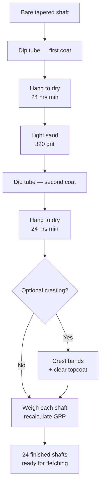

You have 24 straight, tapered Port Orford cedar shafts, carefully matched by  and . Now comes the question that will determine whether those shafts stay matched through a season of shooting: how do you lock in their weight, protect them from the moisture that warps cedar and drifts spine, and mark them so you can find your arrows at a communal target from across the range? The answer involves a , a chosen , optional , and careful arithmetic about .

## The mechanism: sealing, cresting, and why finish weight matters



###  choice: , , or polyurethane

Not all finishes behave the same in a  or on cedar. The three options you will see most often in practitioner discussion are shellac, gasket lacquer, and polyurethane.[^at-sealer]

**Shellac** (dissolved flake shellac or Zinsser SealCoat) dries fast — touch-dry in 30–45 minutes, re-coat in 2 hours — and is compatible with virtually every fletching adhesive and hot-melt point compound. Its main liability is moisture sensitivity: a shellac coat applied in high humidity can blush white as the solvent traps ambient water vapor during drying. For this build — a 24-arrow batch that will be dipped and fletched over a few sessions — shellac is the most forgiving choice for builders who want fast turnaround between coats.

**Gasket lacquer** (e.g., Bull's-Eye, Deft, or automotive gasket shellac) is the traditional dip-tube choice for high-gloss wood arrows. It flows smoothly off a dipped shaft, levels well, and dries harder than shellac — giving a more durable surface that resists scuffing when arrows knock together in the quiver. Dry-to-touch is roughly 30–60 minutes; re-coat in 2–4 hours; fully cured in 24 hours. The practical consensus among wood-arrow builders is that gasket lacquer in the  is the sweet spot for a finished target set: hard enough to last, glossy enough to look purposeful, fast enough that a 24-shaft batch can be double-dipped in a single afternoon.[^at-sealer]

**Polyurethane** (wipe-on or thin-bodied dip formulations) is the most durable option and the most resistant to moisture intrusion over months of outdoor use. The trade-off is drying time: even fast-dry polyurethane needs 4–6 hours between coats, and a full cure takes 24–72 hours per coat depending on temperature. For a batch of 24 arrows, that drying overhead adds up. Polyurethane in the dip tube also requires more careful viscosity management — it thickens faster than shellac in an open tube and can leave drips if pulled out too slowly.

For the 24-shaft matched set, **gasket lacquer or shellac in the dip tube is the recommended path.** Both dry fast enough for two coats in a day, both are compatible with the  used for the 100-grain field points in module 4, and both are available at hardware stores or archery suppliers. If you are working in a basement or garage in late autumn (high humidity, cold), lean toward shellac — it is more forgiving when conditions drift outside the ideal application range.

### Setting up the dip tube

The  is a length of PVC pipe or metal conduit long enough to fully submerge one shaft — for 11/32" shafts at 29–30 inches finished length, a 32-inch tube is the minimum. The bottom is sealed with a PVC cap glued with pipe cement (for permanent use) or a rubber stopper (for portability). Pour the finish in to a depth that covers the full shaft length when a shaft hangs inside.

Setup checklist:

1. Seal the tube bottom — dry-fit the cap first, mark depth, then cement and let cure 1 hour before adding finish.
2. Hang the tube vertically. A joist hook or a piece of all-thread rod through a ceiling joist works; the tube must not tip. Plumb matters: a tilted tube produces uneven dip depth.
3. Fill to depth. Measure the deepest your shaft will hang (tip of the  to the rim of the tube). Fill the finish to that depth plus 1 inch of clearance.
4. Thread a wire hook — a straightened paper clip works — through the nock valley of each shaft. This is your hanging mechanism after dipping.
5. Place a drip catch under the tube. A sheet of cardboard or a tray lined with wax paper collects drips and keeps the workspace clean.



*DIY Arrow Dipping Tube For Wood Arrows. Shows a complete tube build (PVC, cap, mounting) and the dipping motion — vertical tube, hanging line, drip catcher.*

### The dipping sequence

A consistent dip sequence is what keeps your 24-shaft batch matched after finishing.[^coating-consistency]

1. **Wipe each shaft** with a lint-free cloth dampened with denatured alcohol. Remove any dust, skin oil, or taper-tool residue. Oil prevents adhesion; even a thumbprint can cause a fish-eye in the first coat.
2. **Dip slowly** — lower the shaft at roughly 1 inch per second. A fast plunge traps air bubbles against the shaft surface.
3. **Hold at depth for 3–5 seconds**, then withdraw at the same slow rate. Varying your withdrawal speed is the most common cause of uneven coating.
4. **Hang immediately** on the drying rack. The hook through the nock valley keeps the shaft vertical so excess finish runs to the point end and drips off cleanly.
5. **Dry for a minimum of 2 hours** (shellac or gasket lacquer) before handling. Overnight is better and removes the risk of fingerprint impressions in the softening coat.
6. **Sand lightly** between coats with 320-grit sandpaper — just enough to knock down any dust nibs or drip marks. Wipe again with the alcohol-dampened cloth before the second dip.
7. **Repeat for coat 2** (and coat 3 if you want a heavier build). Two coats of shellac or gasket lacquer is the minimum for a target arrow used on foam or burlap targets.

[TODO: learner fills in coat count recommendation from the ArcheryTalk thread before proceeding — the thread distinguishes 2-coat utility finish from 3-coat show finish]

### Sealing the tapered ends: a critical detail

The  and  ends of each shaft are end grain — they absorb finish 2–3× faster than the cylindrical shaft body. If you dip straight into a full-strength finish without accounting for this, the tapered sections will drink in far more sealer than the rest of the shaft. The consequences are two-fold: the finish on the taper builds up thicker, and that extra thickness can interfere with the seating fit of glue-on nocks and field points.[^taper-ends]

The practical fix is simple: after the first full dip coat dries, **give the tapered ends a quick pass with 320-grit** to level any excess buildup before the second coat. Check the  by test-seating a  — it should slide snugly onto the taper without wobble and should not seat so tight that it requires force. If the nock is too tight after two coats, a light sand of the taper with 220-grit followed by a wipe is enough to recover the correct seating depth.

Do the same check at the point taper with a dry field point (no hot-melt yet). The point should slide most of the way on under hand pressure and seat firmly with a gentle press. If the finish has built up enough to prevent seating, sand the taper back to fit.

### Finish weight and GPP: the arithmetic of a matched batch

Finish adds weight. Two coats of gasket lacquer or shellac add approximately 5–15 grains per shaft depending on shaft diameter, finish viscosity, and dip speed.[^finish-weight] For a batch of 24 arrows, the goal is not to minimize finish weight — it is to make finish weight **consistent** across all 24 shafts, so the  match you established in module 2 survives into the finished arrow.

A uniform dip process — same finish viscosity, same dip speed, same drying time before handling — keeps the added weight within 2–3 grains across the batch. Spot-brushing a shaft that got a thin coat, or re-dipping one shaft out of sequence, will put that shaft outside the batch tolerance.

After the final coat is fully cured, weigh each shaft and recalculate GPP:

```
GPP = (shaft weight + point weight + nock weight + fletch weight) ÷ draw weight (lb)
```

For the matched set's 40 lb bow, the target range is **6.5–8 GPP**. Working through the arithmetic with approximate component weights:

| Component | Typical weight (grains) |
|---|---|
|  (28 in, sealed) | ~290–340 |
| 100-grain  | 100 |
| Plastic nock insert | ~8–12 |
| 3× shield-cut left-wing turkey feathers | ~15–25 |
| **Total approximate finished arrow** | **~413–477** |

At 40 lb draw: 413 ÷ 40 = **10.3 GPP** (light end of cedar). 477 ÷ 40 = **11.9 GPP** (heavy end). Both are well above the 6.5 GPP floor, which means the matched set is safely in the mid-to-heavy traditional range — good for a 40 lb left-handed bow shooting foam and burlap targets.[^gpp-target]

If any shaft comes in significantly heavier after sealing (more than 8–10 grains above the batch mean), inspect it for a drip run on the surface. Sand the drip back and spot-coat if needed. If it is lighter, it likely got a thin coat — re-dip it alone and dry fully before re-weighing.

### Cresting: making the matched set visible

 is optional, but for a 24-arrow set shot at communal targets, it is practically useful: a crest pattern unique to this batch lets you identify your arrows from across the range without walking to the target. It also marks the batch visually so you know — and your shooting partners know — which arrows belong together.[^cresting-history]

The classic crest layout for a target arrow reads like this from nock to point:

- **Base color band** (widest — typically 1–1.5 inches): applied first, forms the background for the narrower accent bands.
- **Accent color bands** (medium — 3/8–1/2 inch each): applied second, one or two bands with a clean edge against the base color.
- **Separator lines** (thin — 1/16 inch): applied last with a fine liner brush or a  with a thin pin brush.



The 3Rivers Archery cresting guide states the key craft warning directly: **"Apply wider bands first, then move to thinner bands, with thin separator lines between colors to give the crest a clean finished look."**[^cresting-technique] This sequence matters because a thin separator line painted over an uncured wide band will bleed — the thin brush picks up the still-wet base color and smears it into the separator. Always let each band cure to touch-dry before applying the next.

You choose your own color scheme. For visual identification of the batch, a two-color crest (base plus one accent) is enough to distinguish your arrows from a neighbor's. A three-color crest (base, accent, separator) is the traditional "finished" look.

#### Drying and curing timeline by sealer

| Sealer | Dry to touch | Re-coat window | Full cure |
|---|---|---|---|
| Shellac (SealCoat or flake) | 30–45 min | 2 hrs | 24 hrs |
| Gasket lacquer (Deft, Bull's-Eye) | 30–60 min | 2–4 hrs | 24 hrs |
| Polyurethane (fast-dry wipe-on) | 4–6 hrs | 6–8 hrs | 24–72 hrs |

[TODO: learner confirms these values against the specific product's technical data sheet — temperature and humidity shift all of these numbers, and a cold garage in spring may require 2× the "dry to touch" time]

Apply a clear topcoat over the  before the arrows move to fletching. The topcoat protects the crest paint from scratching during fletching clamp contact and from abrasion in the quiver. One coat of your dip finish, brushed on lightly over the crest zone only, is sufficient.

##  vs. : a contrast

 are an alternative to pre-tapered cedar shafts and are worth understanding before you commit all 24 shafts to the dip tube.

| | Tapered shaft (this build) | Parallel shaft |
|---|---|---|
| Taper steps needed | Already done in module 2 | Must be cut after finishing |
| Cost to source | Slightly higher (pre-tapered) | Lower — bulk cedar parallel shafts are cheaper |
| Nock damage recovery | Difficult — re-tapering disturbs the finish | **Re-taper the damaged end, refinish only that section** |
| Sealing strategy | Seal after tapering; ends absorb faster | Can seal before tapering, then taper through the sealed layer |
| Custom taper control | Set by manufacturer | **Builder controls taper angle and depth** |
| Batch consistency | High if shafts are sourced matched | Depends on builder's taper-tool setup |

**When parallel shafts win:** If a nock end splits in the field — a real risk with repeated use on hard targets — a  lets you cut off the damaged inch, re-taper the fresh end with your taper tool, and seat a new nock. No re-finishing the whole shaft. For a high-volume shooter who breaks nock ends regularly, parallel shafts reduce lifetime build cost significantly. They are also cheaper to source in bulk, and some builders prefer to cut their own taper angles to tighten the seating fit beyond the manufacturer's standard.[^parallel-alt]

**For this build:** The matched set uses pre-tapered 11/32" Port Orford cedar shafts from module 2. All 24 shafts are already tapered and ready for the dip tube. There is no reason to switch now — but if you find yourself re-building shafts after a season of shooting, the parallel-shaft route is worth considering.

## What this means for the matched set

After the dip sequence is complete, the 24 shafts will have a sealed, moisture-resistant finish that locks in the spine and GPI match you built in module 2. The key result is not beauty (though that follows) — it is **consistency of finish weight across all 24 shafts**, which preserves the  calculation and keeps the batch flying identically. The cresting is how you claim those arrows at the target and mark the set as yours.

## Reading

- **Primary:** [ArcheryTalk — "Which Wooden Arrow Sealer and Why"](https://www.archerytalk.com/threads/which-wooden-arrow-sealer-why.2241698/) — Read the full thread for practitioner consensus on shellac vs. gasket lacquer vs. polyurethane — pay attention to the comments distinguishing between dip and wipe-on application.
- **Secondary:** [3Rivers Archery — How to Arrow Cresting](https://www.3riversarchery.com/blog/how-to-arrow-cresting/) — Technique section — the key craft warning about thin coats and sequencing wide bands before thin ones applies directly to the matched set.

## Coming next

Module 4 expects 24 sealed, optionally crested, and finish-weight-confirmed shafts — dry and ready for the , nock inserts, and 100-grain field points.

---

[^at-sealer]: Practitioner consensus from the ArcheryTalk forum thread "Which Wooden Arrow Sealer and Why" — participants compare shellac, gasket lacquer, and polyurethane for dip-tube use, with specific notes on dry time, adhesive compatibility, and gloss level. [archerytalk.com/threads/which-wooden-arrow-sealer-why.2241698/](https://www.archerytalk.com/threads/which-wooden-arrow-sealer-why.2241698/)

[^coating-consistency]: The TradBow.com community discussion "Question About Wood Arrow Finishes" documents common coating defects (fish-eye, drip runs, ) and their causes — most trace to inconsistent withdrawal speed or contaminated shaft surface before dipping. [tradbow.com/forums/topic/question-about-wood-arrow-finishes/](https://tradbow.com/forums/topic/question-about-wood-arrow-finishes/)

[^taper-ends]: End-grain absorption is a documented property of softwoods: the open cells at a cross-cut surface draw liquid finishes in far faster than the longitudinal face grain. The practical consequence for tapered arrow ends — faster buildup, tighter fit on hardware — is a standard caution in wood-arrow building guides. See 3Rivers Archery's building guide for the tapering step: [3riversarchery.com/blog/building-wood-arrows/](https://www.3riversarchery.com/blog/building-wood-arrows/)

[^finish-weight]: Finish weight range of 5–15 grains per shaft is consistent with practitioner reports in the ArcheryTalk sealer thread and TradBow forums — the specific value depends on finish viscosity, number of coats, and shaft diameter. Monitoring batch weight before and after finishing is the only way to know the actual added weight for a given setup.

[^gpp-target]: As BobLeeBows documents: "A midweight traditional arrow target is 6.5–8 GPP. Too light (under 5 GPP) risks bow damage and excessive noise; too heavy reduces trajectory and speed." — BobLeeBows, "Arrow GPI vs GPP." [bobleebows.com/arrows-critical-difference-gpi-gpp/](https://bobleebows.com/arrows-critical-difference-gpi-gpp/)

[^cresting-history]: As 3Rivers Archery explains: "Cresting is the practice of decorating arrows with painted designs. Historically used for arrow identification, it has become a way of personal expression among modern archers." — 3Rivers Archery, "How to Arrow Cresting." [3riversarchery.com/blog/how-to-arrow-cresting/](https://www.3riversarchery.com/blog/how-to-arrow-cresting/)

[^cresting-technique]: 3Rivers Archery, "How to Arrow Cresting" — technique section: "The easiest way to mess up an arrow is to try and hurry through the cresting. Apply wider bands first, then move to thinner bands, with thin separator lines between colors to give the crest a clean finished look." [3riversarchery.com/blog/how-to-arrow-cresting/](https://www.3riversarchery.com/blog/how-to-arrow-cresting/#technique)

[^parallel-alt]: From the research.yaml contrasts: "Parallel shafts allow re-tapering if the nock end splits — you remove a short section and re-taper." — research.yaml contrasts entry, "Tapered shaft vs. Parallel shaft." See also 3Rivers Archery's parallel shaft product page: [3riversarchery.com/port-orford-cedar-wood-arrow-shafts.html](https://www.3riversarchery.com/port-orford-cedar-wood-arrow-shafts.html)
