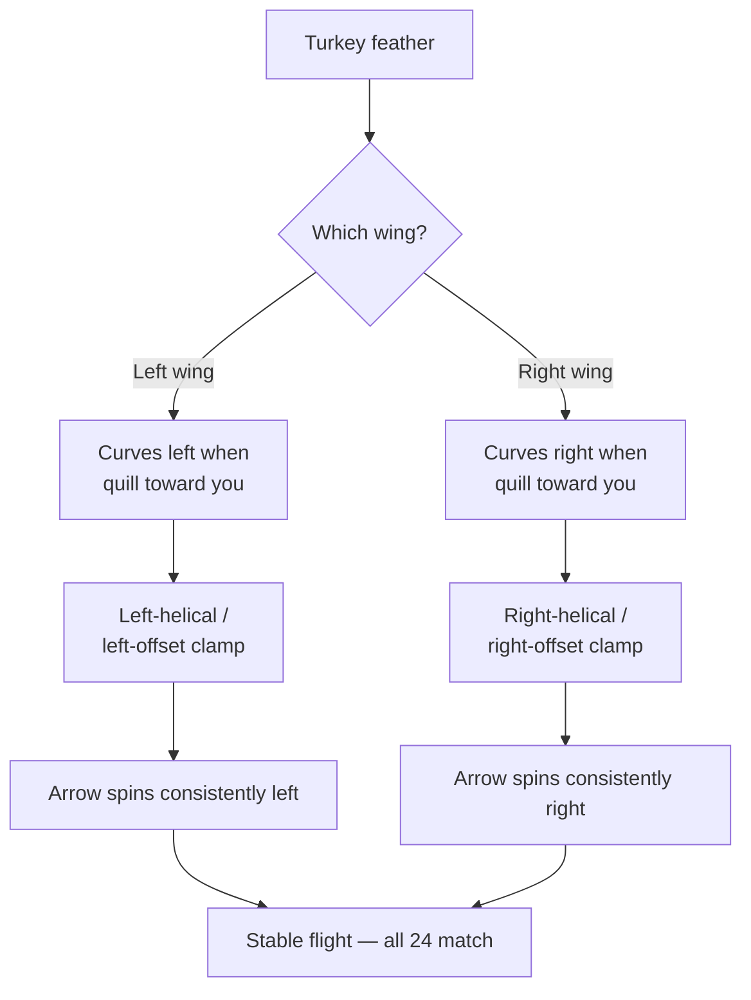
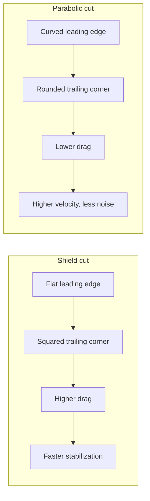
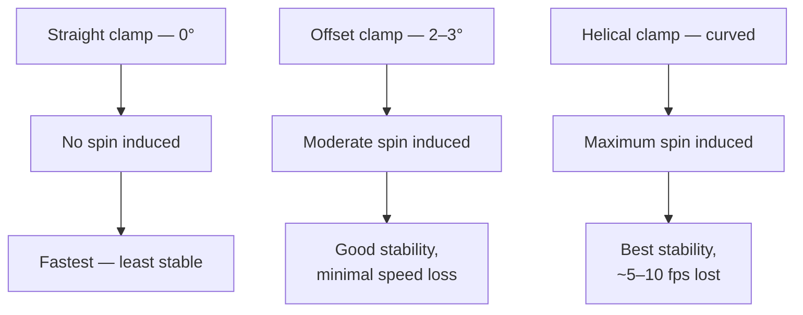

## How do I attach left-wing feathers, glue-on nocks, and 100-grain field points so all 24 arrows fly consistently?

Your 24  shafts are sealed, finished, and waiting. Every shaft is straight, correctly spined, and ready for hardware. The question now is mechanical precision: each feather must go on at the same angle, the same distance from the nock, and from the same wing — and you must install all 72 feathers before the first arrow is worth shooting. Skip one step in that chain and the whole matched set becomes inconsistent. This module walks you through every attachment step in sequence, starting with the most consequential decision you'll make before touching the jig.

---

## The mechanism

### 1. Wing identification: why left-wing matters for a left-handed shooter



 is not symmetric. A feather from a bird's left wing curves in the opposite direction to a feather from the right wing. Hold a feather with the quill pointing toward you and the tip pointing away: a **left-wing** feather curves to your left; a **right-wing** feather curves to your right.[^wingconsistency]

For your matched set, every one of the 72 feathers must come from the **left wing**. Mixing even one right-wing feather into a shaft causes the arrow to fight itself — the feathers will try to spin in opposing directions, producing erratic flight that no amount of tuning will fix.[^3rivers-wing]

**The left-handed shooter's convention:** As a left-handed archer you draw with your right hand and hold the bow with your left. The bow shelf is on the left side of the riser. At full draw, the  (the single feather perpendicular to the nock slot) points away from the bow shelf — the same convention used by right-handed archers, just mirrored. What changes is the wing direction: left-handed archers use **left-wing** feathers, which mate correctly with a **left-offset** or **left-helical** clamp. Your setup uses a left-offset clamp, which is the correct choice.


Hold a feather quill toward you, tip away. A **left-wing** feather curves to your left; a **right-wing** feather curves to your right. As a left-handed shooter you need left-wing feathers exclusively — every one of your 72 feathers (24 arrows × 3 feathers). Mixing wings produces feathers fighting each other and erratic flight no tuning can fix.


**How to tell them apart at purchase:** Most fletching suppliers label their bags "LW" (left wing) or "RW" (right wing). If the label is missing, hold the feather quill-toward-you, tip-away: left-wing curves left. Before loading your jig, lay all 24 sets of three feathers on your bench and verify every quill curves the same direction. This takes five minutes and prevents fletching 24 arrows you have to strip.

### 2.  vs. : profile geometry and what it does

 feathers have a flat leading edge and a squared trailing corner — the silhouette resembles a medieval heater shield.  feathers have a smooth, symmetrical curve on both edges — the classic "half-moon" shape. The difference is surface area.



Shield cut carries more surface area, which means more drag and faster arrow stabilization. For your matched set — 40 lb bow, 28-inch draw, 11/32-inch cedar, shooting off the shelf — shield cut is the right choice. The feather profile reaches stabilizing spin sooner after leaving the bow, which matters when you're shooting an arrow off a traditional shelf (where the cock feather must clear the shelf surface before stabilization begins). Shield cut also corrects for slightly inconsistent  or release variation more aggressively than parabolic — useful for a returning archer rebuilding a consistent shot.[^legendarchery-para]

### 3. Offset clamp mechanics: what 2–3 degrees does and what you give up vs. helical



 means each feather is attached at a slight angle (2–3 degrees) to the shaft axis without physically curving around the shaft circumference. The clamp body is angled; the feather is flat. This is different from , where the clamp has a curved face that wraps the feather around the shaft.

**What offset does:** The angled feather acts like a canted propeller blade. As the arrow accelerates down range, air hits the angled vane face and induces rotation. The arrow spins, the feathers stabilize it, and groups tighten.[^recurvearchery-offset]

**What you give up vs. helical:** Helical produces more spin per inch of travel and gives the tightest groups at long distances. Offset induces less spin, which means slightly less stabilization — but for traditional target distances (10–40 yards with a 40 lb bow), offset is more than adequate and is significantly easier to set up consistently. A helical clamp also requires that the feather physically conform to the clamp's curved face, which can stress the quill. For natural turkey feathers on cedar shafts, offset is the practical standard.[^recurvearchery-offset]

**Left-offset clamp for left-wing feathers:** The left-offset clamp angles feathers so they induce left-hand (clockwise when viewed from the nock end) spin — matching the natural curl of a left-wing feather. If you used a right-offset clamp with left-wing feathers, the clamp would work against the feather's natural curl direction, producing inconsistent contact along the quill and a weak adhesion line. Always match clamp handedness to wing handedness.

### 4.  setup and the 120-degree indexing sequence

Your fletching jig holds the shaft in a fixed cradle. A moveable feather clamp arm loads one feather at a time. The index ring on the jig rotates the shaft (or the clamp arm) by exactly 120 degrees between feathers, producing a symmetrical three-fletch configuration.[^3rivers-jig]


The jig holds the shaft on a central spindle that indexes 120° between fletches. The offset clamp grips a feather along its base, holds it at a 2–3° angle to the shaft axis, and lowers it into position. Every component matters: the nock receiver (alignment), the indexing ring (rotation), the clamp angle (offset amount), the feather-placement stop (distance from nock valley). Bohning and Bitzenberger jigs both have setup videos worth watching before you load your first feather.


**Calibration check before the first shaft:**

1. Load the jig with a spare shaft (or your first shaft).
2. Set the nock-end stop so the trailing edge of the feather will land 1/2 inch to 5/8 inch forward of the nock valley. This is the finger-clearance zone — feathers that start too close to the nock catch draw fingers.[^3rivers-wing]
3. Install the clamp with the left-offset angle set (consult your jig's manual for the degree setting).
4. Do a dry run: load a feather in the clamp without adhesive, lower the clamp arm, verify the feather quill lies flat against the shaft surface along its full length. If the quill lifts in the middle, your offset angle may be too aggressive for the feather profile you're using. Reduce by 0.5 degrees and re-check.
5. Index the jig to position 2 (120-degree rotation), repeat the dry run. Index to position 3 (240 degrees), repeat. All three positions should produce the same flat-quill contact.

**The three-position rotation sequence:**

- **Position 1** — Cock feather. In the jig, this is often the "up" position. The cock feather will be perpendicular to the nock slot when the nock is installed. For a left-handed shooter, the cock feather at full draw faces away from the bow shelf (to the right, away from the left-side shelf). Mark the shaft lightly with a pencil at the nock end before removing it from the jig so you know which feather is which.
- **Position 2** — 120 degrees from position 1. One of the two "hen" feathers.
- **Position 3** — 240 degrees from position 1 (or 120 degrees from position 2). The second .

Always fletch in the same order: cock feather first, then index to position 2, then position 3. Consistency in sequence reduces compounding error across 24 shafts.

### 5. Adhesive selection and cure discipline

Three adhesives are commonly used for natural feathers on sealed cedar:

| Adhesive | Open time | Clamp hold time | Full cure | Notes |
|---|---|---|---|---|
| **Fletch-Tite** (Bohning) | 30–45 sec | 3–5 min | 24 hr | Water-based, flexible when cured; excellent for natural feathers; low odor |
| **** | 30–45 sec | 5–7 min | 24 hr | Slightly stronger bond; same flexibility; preferred for cedar with a hard lacquer finish |
| **Duco cement** | 60–90 sec | 5 min | 24 hr | Solvent-based; very strong but less flexible; can lift finish from some sealers |
| **Super glue gel (cyanoacrylate)** | 15–30 sec | 1–2 min | 1–2 hr | Fastest cure; brittle when set; micro-fractures on flex can release feather at trailing edge |

**Recommended for this build:** Bohning Fletch-Tite Platinum. It bonds well to a sealed cedar surface, remains flexible when cured (important because feathers flex slightly under draw finger pressure and in flight), and the 5–7 minute clamp hold time is long enough to allow the quill to seat fully but short enough to maintain a reasonable working pace across 24 shafts.[^3rivers-wing]

**Cure discipline:** After releasing the clamp, do not rotate to the next feather position for a minimum of 5 minutes (per Fletch-Tite Platinum spec). Moving the shaft while adhesive is still green will micro-shift the feather position. Work one shaft through all three positions, then set it aside for 24 hours before handling. Do not fan-dry or use heat — forced cure increases brittleness at the quill edges.

**Application:** Apply a thin, continuous bead along the full length of the feather clamp's channel (where the quill will sit). Do not apply to the quill directly — the clamp distributes adhesive more evenly. Close the clamp with steady pressure; a slight squeeze-out along the quill edge is correct. Excess squeeze-out on the **vane face** (the colored feather surface) indicates too much adhesive and must be wiped immediately with a dry cotton swab — adhesive on the vane surface disrupts airflow.

### 6. Nock installation: alignment relative to the cock feather

A  (glue-on ) slides over the  at the back of the shaft. The  provides a consistent friction fit before adhesive is applied.

**Cock feather perpendicular to the nock slot:** The nock slot must be oriented so that at full draw, the nock groove sits on the bowstring with the cock feather pointing away from the bow. For a left-handed shooter with a left-side shelf, "away from the bow" means pointing to the right when the bow is at full draw and vertical.

**Why this matters:** If the nock slot is rotated even 30 degrees off, the cock feather will partially face the shelf at full draw and contact the riser as the arrow exits. A single feather touching the bow during the shot is enough to kick the arrow out of group — sometimes dramatically. Correct nock alignment before the adhesive touches the shaft.

**Installation sequence:**

1. With the cock feather still marked (pencil mark at nock end), seat the dry nock on the taper and rotate it until the nock slot is perpendicular to the cock feather. The slot opening should be 90 degrees offset from the cock feather quill.
2. Confirm alignment by sighting down the shaft from the nock end: nock slot on one axis, cock feather on the perpendicular axis.
3. Apply a small drop of fletching adhesive (Fletch-Tite or ) to the taper — not to the nock interior — and reseat the nock immediately. The adhesive should wick into the interface; you do not need a full bead.
4. Hold for 30 seconds. Do not use hot-melt for nocks. Hot-melt becomes brittle under repeated string impact and can crack the nock seat at the moment you least want it to.
5. Set aside for full cure before shooting.

### 7. Field point installation: hot-melt and the tip-roll alignment check

 installation uses  applied via an alcohol burner. Hot-melt is the correct choice here — it bonds strongly, is field-removable (reheat to break the bond), and allows resetting a crooked point without damaging the .[^3rivers-points]


Heat a stick of hot-melt cement, apply it to the cleaned shaft taper, and seat the field point while rotating slowly so the cement cures evenly. Re-heat the point briefly with an alcohol burner to release if you need to remove it later. A roll-test on a flat surface checks tip alignment — wobble means the point is off-axis and needs reseating.


**Installation sequence:**

1. Wipe the inside of the field point with an alcohol-dampened cotton swab to remove manufacturing residue (cutting oil, metal dust). Wipe the 5-degree  on the shaft with the same swab. Let both dry for 60 seconds.
2. Light the alcohol burner. Hold the field point in pliers — do not hold it bare-handed; it will reach 200°F+.
3. Heat the point over the burner flame, rotating continuously, for 10–15 seconds until the metal is warm throughout (not glowing).
4. Touch a stick of hot-melt adhesive to the inside of the point — it should melt on contact. Apply enough to coat the interior cone, but do not pack it full; excess adhesive has nowhere to go but back out over the taper.
5. Immediately slide the point onto the shaft taper with a twisting motion (clockwise and counterclockwise alternating, two or three cycles). This distributes the hot-melt evenly around the taper.
6. While the adhesive is still warm and pliable, sight down the shaft from the nock end. Rotate the point slightly until it appears concentric with the shaft. Hold steady for 15–20 seconds while the adhesive sets.
7. Once cool, perform the ****: place the arrow on a flat surface (a glass table or sheet of paper on a level workbench). Give it a slow roll. Watch the point. A correctly seated point will roll smoothly. A wobbling or hopping tip indicates eccentricity — the point bore is not concentric with the shaft axis. Reheat and reseat.[^3rivers-points]

**Epoxy alternative:** Two-part epoxy (e.g., 30-minute epoxy) can substitute for hot-melt. It produces a permanent bond that will not soften in a hot car or direct sunlight. The trade-off: a crooked point cannot be rescued without destroying the shaft taper, and the point cannot be removed in the field. For a matched target set where you plan to shoot these arrows for years, hot-melt is the correct choice because it allows maintenance.

### 8. FOC calculation on the finished arrow

 is the metric that tells you how top-heavy your arrow is — specifically, how far forward of the physical midpoint the balance point sits, expressed as a percentage of total arrow length.[^easton-foc]

**The formula:**

```
FOC% = ((balance point − length/2) / length) × 100
```

**Worked example for the matched set:**

Your finished arrow (with nock, feathers, and point installed):
- Total length: 29 inches (28-inch draw + 1 inch for the nock valley to string contact, typical for cedar)
- Midpoint: 29 ÷ 2 = **14.5 inches** from the nock valley

Rest the arrow across a narrow fulcrum — a ruler edge, a pencil, or a knife blade laid flat. Slide the arrow until it balances perfectly horizontal. Mark this point with a pencil.



Measure from the **nock valley** to the balance point mark. Suppose you measure **16.8 inches**.

```
FOC% = ((16.8 − 14.5) / 29) × 100
     = (2.3 / 29) × 100
     = 7.9%
```

**Target range:** For traditional target archery, Easton's FOC guide recommends 10–15% as the optimal range.[^easton-foc] The 3Rivers building guide and most traditional practitioners cite 8–12% as a practical target for a 40 lb setup at typical indoor/outdoor distances.

A result of 7.9% is at the low edge — acceptable, but you could move toward 10% by:

- Adding a slightly heavier point (move from 100 gr to 110 or 125 gr)
- Trimming 1/4 inch from the nock end (shortens the shaft and shifts the midpoint forward)
- Both together

For this build — 100 grain points are specified — accept the result if it falls in the 7–12% range and proceed to tuning. If FOC comes out below 7%, investigate whether all components are installed and weighed correctly before changing point weight.

---

## Shield cut vs. parabolic cut: when each wins

| Factor | Shield cut (your choice) | Parabolic cut (alternative) |
|---|---|---|
| Surface area | Higher — more drag | Lower — less drag |
| Stabilization speed | Faster — reaches stable spin sooner | Slower — needs more distance |
| Velocity loss | ~3–5 fps vs. parabolic | Minimal |
| Noise in flight | More audible (feather flutter) | Quieter |
| Form correction | More aggressive — masks minor errors | Less corrective — shows errors in groups |
| Best for | Off-the-shelf, returning archer, slightly under-spined arrows | Well-tuned setups, consistent form, long-distance target |
| **When alternative wins** | — | Spine is correctly matched and form is consistent; at longer distances the parabolic's lower drag preserves trajectory. Also better for a returning archer who wants cleaner feedback from groups rather than having errors masked. |
| Set aesthetic | Classic traditional look | Clean, minimal |

For your 24-arrow matched set with a 40 lb bow and an offset clamp, shield cut is the correct starting choice. You can always re-fletch a subset with parabolic later to compare groups — a worthwhile experiment once your form is rebuilt.

---

## What this means for the matched set

You are building 24 arrows to a single specification: left-wing turkey feather, shield cut, offset clamp, 120-degree three-fletch, Fletch-Tite Platinum adhesive, plastic nock inserts aligned to the cock feather, 100-grain hot-melt field points, FOC in the 8–12% range. Every decision in this module is downstream of that specification.

The reason consistency across 24 shafts matters more than any single "perfect" arrow: when you set a  and tune your bow in Module 5, you are tuning the bow to the center of the group, not to any individual arrow. If three arrows have feathers at slightly different angles and two have crooked points and one has the wrong wing feather, your tuning group will be large and your diagnostic information will be noise. Twenty-four arrows built to the same spec produce a group you can actually learn from.

The fletching log (see Exercise 2) is not busywork. It is the quality-control record that tells you, six months from now, why arrow 14 is always flying slightly left.

---

## Reading

1. **3Rivers Archery — Building Wood Arrows**, Fletching and Point Mounting sections: [3riversarchery.com/blog/building-wood-arrows/](https://www.3riversarchery.com/blog/building-wood-arrows/) — the wing-consistency rule and the  process both live here; read them before touching any feather or point.

2. **Wikipedia — Fletching**, Feather orientation section: [en.wikipedia.org/wiki/Fletching](https://en.wikipedia.org/wiki/Fletching) — the canonical statement on wing consistency and the slow-motion analysis finding that spin begins after the arrow passes the riser, which explains why consistency matters more than theoretical direction preference.

---

## Coming next

Module 5 assumes you have 24 fully assembled arrows — left-wing shield-cut three-fletch with offset, glue-on plastic nocks, 100-grain glue-on field points — with FOC verified and tip alignment confirmed; it opens immediately with  and the bow setup workflow.

---

[^wingconsistency]: As Wikipedia's Fletching article notes: "A right handed archer should shoot a right winged feather and right handed helical, and a left handed archer should use the opposite. Modern slow-motion analysis reveals that the arrow does not begin to spin until it is well past the riser, making consistency in fletching more critical than theoretical preferences." — *Wikipedia — Fletching*, [en.wikipedia.org/wiki/Fletching#feather-orientation](https://en.wikipedia.org/wiki/Fletching)

[^3rivers-wing]: As 3Rivers Archery's building guide states: "All feathers on an arrow must be from the same wing for proper flight. When mounting feathers on shafts, the feather should be placed with the trailing edge between 1/2\" and 5/8\" down from the nock, which allows for finger clearance." — *3Rivers Archery — Building Wood Arrows*, [3riversarchery.com/blog/building-wood-arrows/#fletching](https://www.3riversarchery.com/blog/building-wood-arrows/)

[^legendarchery-para]: As Legend Archery's parabolic fletching page explains the trade-off between profiles: shield cut feathers provide more drag and faster stabilization relative to parabolic, which is "the standard profile for most target arrows" but produces "slightly less drag" — useful when spine is correctly matched and form is consistent. — *Legend Archery — Parabolic Fletching*, [legendarchery.com/pages/parabolic-fletching](https://legendarchery.com/pages/parabolic-fletching)

[^recurvearchery-offset]: As RecurveArchery.net's offset/helical guide explains:  "induces spin and is easier to achieve with simpler jig clamps than true helical; a reasonable compromise between stabilization and setup simplicity." Helical produces maximum spin but requires a helical clamp that physically wraps the feather around the shaft circumference. — *RecurveArchery.net — Arrow Fletching Types and Offsets*, [recurvearchery.net/arrow-fletching-types-and-offsets-improve-accuracy-and-stability/](https://recurvearchery.net/arrow-fletching-types-and-offsets-improve-accuracy-and-stability/)

[^3rivers-jig]: As 3Rivers Archery's building guide describes, a fletching jig "holds the arrow shaft and a single feather clamp in a fixed geometric relationship — controlling the feather's position, rotation (120° spacing for three-fletch), and angle — while the adhesive sets." — *3Rivers Archery — Building Wood Arrows*, [3riversarchery.com/blog/building-wood-arrows/#fletching](https://www.3riversarchery.com/blog/building-wood-arrows/)

[^3rivers-points]: As 3Rivers Archery's point mounting guide states: "Use hot-melt adhesive applied via alcohol burner. Wipe out the inside of your point with alcohol-soaked cotton to remove manufacturing residue. Heat the point, glue, and shaft simultaneously, then rotate to ensure straight alignment before cooling." — *3Rivers Archery — Building Wood Arrows*, [3riversarchery.com/blog/building-wood-arrows/#point-mounting](https://www.3riversarchery.com/blog/building-wood-arrows/)

[^easton-foc]: As Easton Archery's FOC guide explains: " (FOC) describes the percentage of an arrow's total weight positioned in the front half of the shaft. Higher FOC produces stable flight... Easton recommends 10–15% FOC for hunting setups to achieve optimal accuracy." The calculation: "Divide total arrow length by 2 to find the midpoint. Locate the physical balance point. Subtract the midpoint from the balance point. Multiply by 100. Divide by total arrow length." — *Easton Archery — What Is FOC and How Does It Affect Arrow Flight*, [eastonarchery.com/2014/06/foc/](https://eastonarchery.com/2014/06/foc/)
