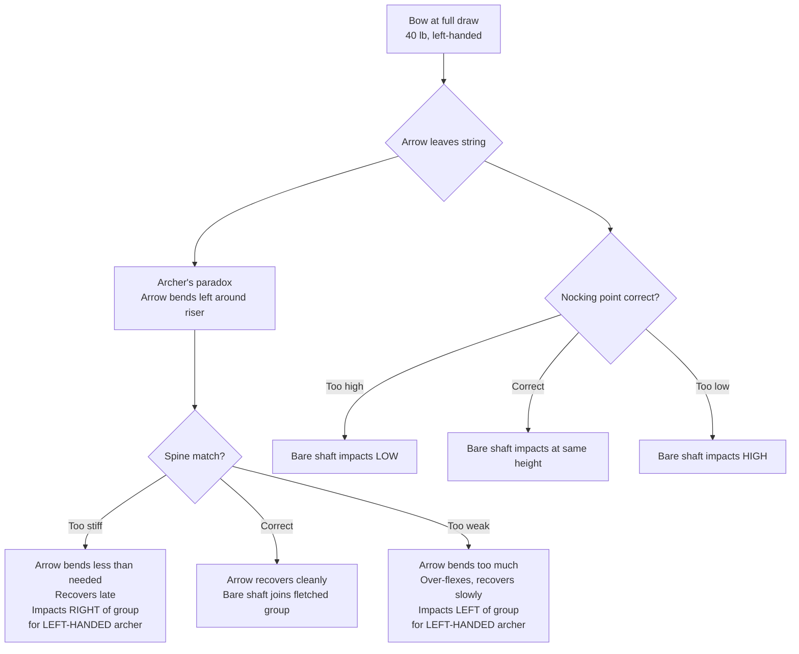

You have 24 finished arrows in hand. You know their , their weight, their FOC. But none of that proves they fly well together from *your* bow with *your* release. The only honest proof is shooting a bare shaft alongside a fletched group and reading where it lands. This module tells you exactly how to read that landing — correctly for a left-handed archer — how to adjust when the reading is wrong, and how to recover each arrow type when it inevitably breaks.

---

## The Mechanism: What  Actually Reveals

The essential insight of  is that a fletched arrow lies. Feathers are aerodynamic correctors: they straighten a poorly-flying shaft enough that it lands close to a well-flying one, masking the underlying mismatch. Strip the feathers off and the arrow can only do what physics forces it to do — flex through , recover, and fly downrange without any aerodynamic help. Whatever error exists in your setup, the bare shaft will show it.[^bareshaft-reveals]

The diagram below shows the full causal chain from bow to target. Follow it top to bottom: the bare shaft either recovers cleanly (and impacts with the fletched group) or it doesn't (and impacts offset in a direction that tells you *why*).

Two independent questions are answered simultaneously: **horizontal** deviation tells you about  (spine match), and **vertical** deviation tells you about  position. Fix them one at a time.[^bareshaft-procedure]

### The Left-Handed Inversion: Read This Before You Touch Anything

The standard bareshaft tuning table published in almost every archery reference was written for a right-handed archer. A right-handed archer's arrow passes to the left of the riser on release — so a stiff arrow, which does not flex enough, impacts to the left of where it should. A left-handed archer's arrow passes to the *right* of the riser. The flex direction is mirrored. **Every horizontal reading flips.**[^lh-inversion]

Vertical readings (high/low) are the same for both handednesses — they reflect  position, not paradox direction.

| Bare shaft position relative to fletched group | Right-handed archer diagnosis | **Left-handed archer diagnosis (you)** |
|---|---|---|
| Bare shaft impacts **LEFT** of group |  too **stiff** | Spine too **weak** |
| Bare shaft impacts **RIGHT** of group | Spine too **weak** | Spine too **stiff** |
| Bare shaft impacts **LOW** | Nocking point too **high** — move it down | Same — move nocking point down |
| Bare shaft impacts **HIGH** | Nocking point too **low** — move it up | Same — move nocking point up |
| Bare shaft joins the fletched group | Tuned correctly | Tuned correctly |

Print this table and keep it in your quiver bag. If you have ever used a right-handed tuning chart before, your muscle memory will get the horizontal reading backwards. Tape an "L" to your bow riser as a reminder if needed.

### Setting the Starting Nocking Point

Before you shoot a single bare shaft, your  needs a defensible starting position. The widely cited standard for traditional bows: set it approximately **1/2 inch above the arrow shelf**, measured with a  placed against the string.[^nocking-start]

With a brass crimp-on nock set, do not fully crimp it yet — leave it movable so you can nudge it after the first bareshaft group. The T-square measurement gets you into the right neighborhood; the bare shaft group tells you the exact address.

### Spine Adjustment Without Buying New Shafts

When the bare shaft lands off-group horizontally, your first adjustment should be **point weight**, not a new shaft order. Point weight changes  without touching the shafts:

- **Left-handed: bare shaft lands RIGHT (stiff)** — add heavier points. A 125-grain point in place of 100-grain stiffens the front-heavy load and effectively weakens . You want it to flex *more*, so you load the front more.
- **Left-handed: bare shaft lands LEFT (weak)** — try lighter points. Dropping from 100 grains to 75 grains stiffens dynamic spine. You want it to recover faster.[^spine-adj]

The logic feels backwards until you remember what dynamic spine is: not the shaft's raw stiffness, but how it behaves under load in flight. Adding weight to the front loads the shaft and makes it flex more, which is exactly what a too-stiff (right-impact) shaft needs.

After a point-weight change, reshoot the bare shaft group before making any other adjustment. One variable at a time.

### : The Brief Mention It Deserves

 is a third method worth knowing: shoot at the same vertical aiming point from progressively farther distances (5, 10, 15, 20 yards). If your arrows drift consistently left or right as distance increases, your  alignment is off — the arrow rest position needs lateral adjustment, not spine or nocking point work. Walk-back is most useful when bareshaft groups look clean but you still can't hold a vertical group at distance.[^walkback]

---

## Contrast: Bareshaft Tuning vs. 

 works by shooting an arrow through paper stretched on a frame at very close range (6–8 feet). The tear pattern — bullet hole (ideal), tail-high, tail-low, tail-left, tail-right — shows the arrow's orientation *at the moment it passes through* the paper.

| Dimension | Bareshaft tuning | Paper tuning |
|---|---|---|
| Distance | 10–20 yards | 6–8 feet |
| What it shows | Group-averaged spine match + nocking point | Single-arrow orientation at clearance |
| Form influence | Averaged across multiple shots | Highly sensitive to a single release |
| Best for | Matched-set verification, dynamic spine confirmation | Single-arrow diagnosis, isolating finger pinch or torque |
| **When the alternative wins** | When you want to know if one specific shaft has a form-interaction problem, or when you want a fast visual without walking the target | When verifying that all 24 arrows in the set are consistent with each other |
| Limitation | Requires walking to the target between shots | A bad release produces a misleading tear that wastes time chasing a non-problem |

**Paper tuning wins** when you suspect a form issue (finger pinch, torque, timing) rather than a spine issue. It shows you what a single shot is doing at the critical moment — bow clearance — in a way that a group cannot. It is also faster for a single-arrow diagnostic session when you need one quick answer.[^paper-tuning]

For the matched set of 24  arrows, bareshaft tuning is the right primary tool. You are not diagnosing one arrow's behavior — you are verifying that the whole set is consistent, and group averaging is what gives you that confidence.

---

## What This Means for the Matched Set

You have 24 left-wing shield-cut three-fletch arrows on 11/32-inch Port Orford cedar shafts with 100-grain glue-on field points, built for a 40 lb left-handed bow. Your static spine selection was done in module 1 using the Stu Miller calculator and the AMO chart — you have a good starting point. But static spine is a lab number. Dynamic spine is what you shot.

The bareshaft session is the proof-of-build: it either confirms your spine selection was accurate or tells you exactly how to adjust without buying new shafts. For most builders who followed the selection charts, the bare shaft will land within a couple of inches of the fletched group on the first session and will fully join the group after one nocking point adjustment. The point-weight adjustment path is there if you need it, but at 40 lb with 100-grain points on 11/32-inch cedar, the charts are reliable.[^charts-reliable]

After the bareshaft session is resolved, every subsequent session starts with the maintenance checklist in the next section. The repair workflows exist for when that checklist turns up a problem.

---

## Maintenance: The Practitioner Routine

Arrows break in predictable ways. The practitioner's advantage is catching damage early — before a cracked nock becomes a string-snap at full draw, or before a loose point becomes a point left in the target while the shaft flies back.

### Post-Session Inspection (Every Time)

Run this after every shooting session, before the arrows go back in the quiver:

1. **Nock check:** Grip each nock between thumb and forefinger and apply lateral pressure in both directions. Any flex, crack sound, or visible crack line means the nock comes off and a new one goes on before the arrow shoots again. A cracked nock can shatter on release.
2. **Roll test:** Lay each arrow on a flat surface and roll it with your palm. The tip should trace a smooth circle. If the tip wobbles visibly, the shaft is bent or the point is seated crooked. Quarantine and diagnose.
3. **Feather trailing edge:** Run a thumb lightly along the trailing edge of each feather from base to tip. Lifting or separating feather bases feel immediately different from seated ones. Catch them early and re-glue; ignore them and lose the feather mid-session.
4. **Point seating:** Grip the field point and try to rock it laterally. A properly hot-melted point is completely rigid. Any movement means the hot-melt has failed — re-seat before the next session.
5. **After any miss into a hard surface** (tree, rock, post): Flex the shaft gently in a full circle. Cedar that has taken a grain-compressing impact may look straight but be internally fractured. If you feel or hear any click or creak under gentle flex, cull that shaft.

### Seasonal Checks (Once or Twice a Year)

- **Refinish if matte:** A matte or chalky finish means the moisture barrier has worn through. Dip the shafts again or apply a wipe-on polyurethane coat before storing through a humid season. Unprotected cedar absorbs moisture and spine drifts.
- **Re-crest if worn:**  is cosmetic but it is also the identification system for your matched set. If the crest lines are worn to the point where you cannot distinguish your arrows from a rangemate's, touch them up.
- **Store vertically or horizontally:** Cedar shafts stored leaning at an angle — against a wall, in a bag corner — take a set in the direction of the lean over weeks. Store upright in a quiver or horizontal in a rack.

---

## Repair Workflows: The Four Common Failures

### 1. Broken or Loose Nock

A nock that cracks, loosens, or rotates is the most common failure in a target set. The repair is reliable and takes under five minutes.

**Procedure:**

1. Apply gentle heat (heat gun on low, or run the nock end near — not over — a candle flame for 2 seconds) to soften the .
2. While the cement is warm and pliable, grip the nock with pliers and pull straight off the taper. Do not twist — the  is symmetric; pulling straight removes the nock cleanly.
3. Use a folded edge of 220-grit sandpaper or a cotton swab dampened with alcohol to clean any cement residue from the taper.
4. Inspect the taper for cracks propagating into the shaft. Any crack longer than 1/4 inch means the shaft needs culling, not a new nock.
5. Apply a thin coat of nock cement (Bohning Fletch-Tite or equivalent) to the taper.
6. Press the new nock on firmly, rotating it to align the nock groove with the  (the single feather that runs perpendicular to the string — on a left-handed bow with left-wing feathers, confirm the rotation matches the original orientation).
7. Let cure for the adhesive's specified time before shooting.


A nock-end split runs along the grain from the nock slot toward the body of the shaft. Hairline cracks under ~1/4 inch are usually repairable by re-tapering and re-nocking. Cracks longer than 2 inches, or any visible split that has run past the taper into the shaft body, are a cull — that arrow will fail unpredictably.


### 2. Loose or Lost Field Point

 loosens with heat — a car left in summer sun, a quiver laid on warm concrete, or a point that took a bad impact. The repair is identical to the original installation.

**Procedure:**

1. Apply gentle heat to the point end until the hot-melt softens (a few seconds near a heat gun or alcohol burner on low). Do not char the wood.
2. Grip the point with pliers and pull it straight off. If the point is already gone (left in the target), skip to step 3.
3. Clean the taper with an alcohol-dampened cotton swab. Remove all old adhesive. The taper must be clean for the new hot-melt bond to seat fully.
4. Inspect the taper for damage. If the taper end shows compression or splitting, see the re-tapering note below.
5. Apply hot-melt adhesive to the taper (stick adhesive or pellets in an adhesive gun — either works). Seat the new or recovered point while the adhesive is hot, rotating it to align straight.
6. Before the adhesive fully cools, roll the arrow on the flat surface and confirm the tip traces a smooth circle. Adjust point alignment while still workable.

**Re-tapering note:** If the  is damaged — compressed, split, or shortened from multiple re-taper cycles — you can re-taper by removing approximately 3/4 inch of shaft length and cutting a fresh taper with the taper tool. This shortens the arrow. If the shortened arrow falls below your minimum length ( plus 1 inch of pass-through for safe shooting), cull the shaft rather than risk an underpowered short arrow.[^tapering-note]

### 3. Lifted or Lost Feather

A feather base that has separated from the shaft — whether lifted at one end or fully detached — needs a clean surface before re-adhesion.

**Procedure:**

1. Peel the affected feather fully off the shaft. Attempting to re-glue a partially adhered feather over old adhesive produces a weak, lumpy bond.
2. Use 220-grit sandpaper to lightly sand the adhesion zone on the shaft. The goal is to break the glaze of the old adhesive and give the new adhesive a mechanical bite — not to remove wood.
3. Return the arrow to the , placing it in the same position as the original fletch (same rotation stop, same clamp orientation). A left-wing shield-cut feather in an offset clamp must go back in the same orientation as the other two feathers; putting it in backwards or with reversed offset will produce a feather that fights the spin direction.
4. Apply fletching adhesive to the feather base and clamp for the adhesive's specified time.
5. After cure, run the thumb test: the repaired feather should feel identically seated to its neighbors.

**If the feather is lost entirely:** Only replace it with a feather from the same batch — same wing (left-wing), same cut profile (shield), and ideally same dye lot for visual consistency. A single mismatched feather in the set introduces inconsistency that defeats the matched-set goal. If no matching replacement is available, quarantine that arrow from the active set until a matching feather can be sourced. Do not mix wings or cut profiles within the set.[^feather-consistency]

### 4. Shaft Split at the Nock End

This is the only repair judgment call with a meaningful safety dimension. A split nock end that fails at full draw can drive a cedar splinter into the draw hand.

**Assessment procedure:**

1. Measure the crack length from the nock taper mouth toward the shaft body.
2. If the split is **under 1/4 inch** and hairline: thin cyanoacrylate (thin CA) wicked into the crack under light clamp pressure can stabilize it. This is a conditional repair, not a confident one — inspect this arrow at every session and retire it at the first sign of further propagation.
3. If the split is **1/4 to 1/2 inch**: the honest call for a target arrow that will be shot repeatedly is to retire the shaft from the primary set. You may attempt re-tapering (remove 2–3 inches of shaft length below the split, cut a new 11-degree nock taper) *only* if the resulting arrow length remains within your safe shooting length. Cedar at 40 lb draw — the nock end takes repeated string impact every shot. A repaired split there is a structural weak point.
4. If the split is **longer than 1/2 inch** or if the crack follows the grain into the shaft body: cull unconditionally. The shaft is done.

**The honest practitioner rule:**

- Shaft with a **body crack** (crack running along the grain in the middle section of the shaft): always cull. A body crack can propagate to complete shaft failure at full draw.
- Damaged **nock taper** (nock loose, taper compressed, or crack under 1/4 inch): always repair if the shaft is otherwise sound. This is low-risk and low-cost.
- Damaged **point taper**: always repair if re-tapering leaves the arrow within safe length. Also low-risk.
- Cracked **nock end longer than 1/4 inch**: cull from the target set. The risk-to-reward ratio doesn't favor repair for an arrow you will shoot hundreds of times.


Before reaching for the heat gun, hold the broken arrow up to a strong light. A hairline crack confined to the taper itself: re-taper 3/4 inch lower, install a fresh nock. A crack that has propagated past the taper into the parallel shaft: cull. Compression cracks that run the length of the shaft (rare in cedar, more common in fir) are always a cull regardless of taper condition.


---

## Reading

- **Primary:** Archery360 — "How to Bare-Shaft Tune Your Recurve or Longbow." The "What It Reveals" and "Horizontal Adjustments" sections contain the key diagnosis table. Note that the horizontal table is written for right-handed archers — **reverse the left/right readings for a left-handed archer**. [archery360.com/2019/07/10/how-to-bare-shaft-tune-your-recurve-or-longbow/](https://archery360.com/2019/07/10/how-to-bare-shaft-tune-your-recurve-or-longbow/)

- **Secondary:** 3Rivers Archery — "Basic Longbow and Recurve Set-Up." The nocking point and spine adjustment sections include the porpoising/fishtailing diagnostic and the point-weight adjustment method for fine-tuning dynamic spine without buying different shafts. [3riversarchery.com/blog/longbow-and-recurve-set-up/](https://www.3riversarchery.com/blog/longbow-and-recurve-set-up/)

---

## Coming Next

You have shot the bareshaft group, confirmed (or adjusted) spine match, set the nocking point, and worked through all four repair procedures — the 24-arrow matched set is finished, tuned, and maintained, and you hold practitioner-level competency to keep it that way.

---

[^bareshaft-reveals]: As Archery360 explains: "Bare-shaft tuning reveals whether your arrow spine matches your setup and whether your nocking point is correctly positioned. Fletching masks imperfections, while bare shafts expose them." — *How to Bare-Shaft Tune Your Recurve or Longbow*, Archery360 (2019), [archery360.com/2019/07/10/how-to-bare-shaft-tune-your-recurve-or-longbow/#what-it-reveals](https://archery360.com/2019/07/10/how-to-bare-shaft-tune-your-recurve-or-longbow/)

[^bareshaft-procedure]: As Archery360's horizontal-adjustments section states: "Left impact = spine too stiff. Right impact = spine too weak. (Reverse for left-handed archers.)" — *How to Bare-Shaft Tune Your Recurve or Longbow*, Archery360 (2019), [archery360.com/2019/07/10/how-to-bare-shaft-tune-your-recurve-or-longbow/#horizontal-adjustments](https://archery360.com/2019/07/10/how-to-bare-shaft-tune-your-recurve-or-longbow/)

[^lh-inversion]: The left-handed inversion follows directly from  mechanics: a left-handed archer's arrow deflects to the right around the riser on release, which is the mirror image of a right-handed release. The paradox recovery direction is therefore mirrored, and so is the diagnostic table. See: *Archer's paradox*, Wikipedia, [en.wikipedia.org/wiki/Archer%27s_paradox](https://en.wikipedia.org/wiki/Archer%27s_paradox)

[^nocking-start]: As 3Rivers Archery notes: "Most traditional bows like to have the nocking point approximately 1/2 inch above the shelf." — *Basic Longbow and Recurve Set-Up*, 3Rivers Archery, [3riversarchery.com/blog/longbow-and-recurve-set-up/#nocking-point](https://www.3riversarchery.com/blog/longbow-and-recurve-set-up/)

[^spine-adj]: As 3Rivers Archery's spine-adjustment section explains: "Arrow too stiff (impacts left for right-handed archers): Add heavier points. Arrow too weak (impacts right): Try lighter points." — *Basic Longbow and Recurve Set-Up*, 3Rivers Archery, [3riversarchery.com/blog/longbow-and-recurve-set-up/#spine](https://www.3riversarchery.com/blog/longbow-and-recurve-set-up/) Note: for a left-handed archer, the impact directions are reversed as described in the table above.

[^walkback]: Walk-back tuning is described in the archery supplier community guide: "Shoot from progressively greater distances at the same vertical aiming point. Consistent vertical grouping with horizontal drift identifies  alignment errors." — *Recurve Bow Tuning Guide: Bare Shaft, Paper & Walk-Back*, Archery Supplier, [archerysupplier.com/recurve-bow-tuning-guide/](https://archerysupplier.com/recurve-bow-tuning-guide/)

[^paper-tuning]: As defined in the archery supplier community tuning guide: "Paper tuning — the tear pattern (bullet hole ideal, tail-high, tail-low, tail-left, tail-right) indicates nocking point position and spine match at the moment the arrow passes through." — *Recurve Bow Tuning Guide: Bare Shaft, Paper & Walk-Back*, Archery Supplier, [archerysupplier.com/recurve-bow-tuning-guide/](https://archerysupplier.com/recurve-bow-tuning-guide/)

[^charts-reliable]: The Stu Miller Dynamic Spine Calculator and the Rose City Archery spine chart are the community-standard starting points for cedar shaft selection. The calculator was "developed to aid the traditional archer in defining the appropriate arrow setup to match a given bow design. The formulas are derived primarily from modern deflex/reflex longbow and recurve designs based on actual shooting experience coupled with basic engineering principles." — *Stu Miller's Dynamic Spine Calculator*, [heilakka.com/stumiller/](https://heilakka.com/stumiller/)

[^tapering-note]: The measurement sequence for re-tapering: "Measure from the nock valley to desired length, then add 3/4\" to 7/8\" for the taper before cutting." — *3Rivers Archery — Building Wood Arrows*, [3riversarchery.com/blog/building-wood-arrows/#tapering](https://www.3riversarchery.com/blog/building-wood-arrows/)

[^feather-consistency]: As 3Rivers Archery's fletching guide states: "All feathers on an arrow must be from the same wing for proper flight." — *Building Wood Arrows*, 3Rivers Archery, [3riversarchery.com/blog/building-wood-arrows/#fletching](https://www.3riversarchery.com/blog/building-wood-arrows/)
